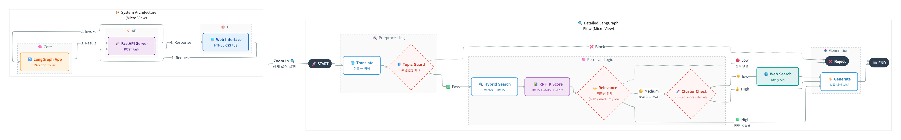
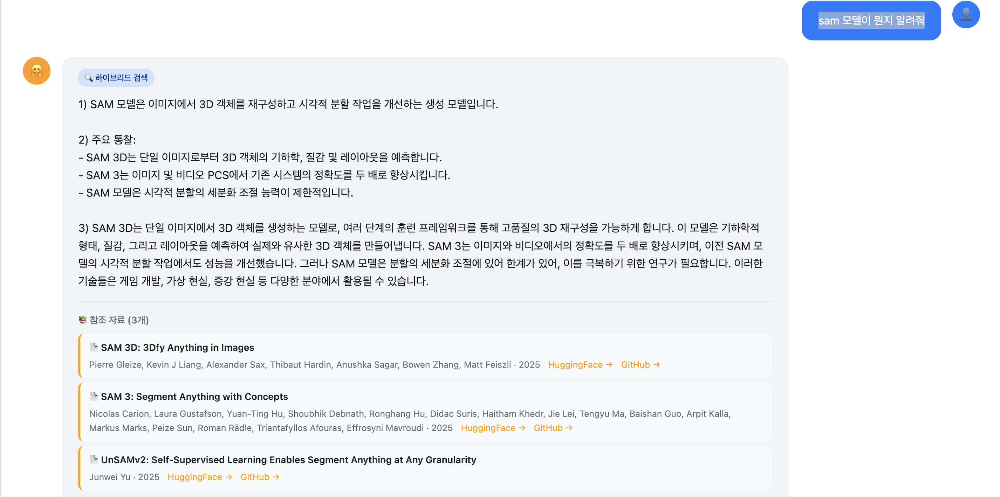
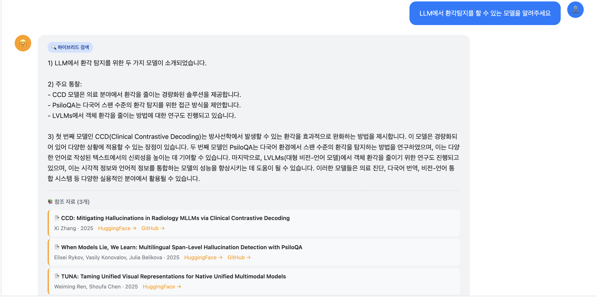
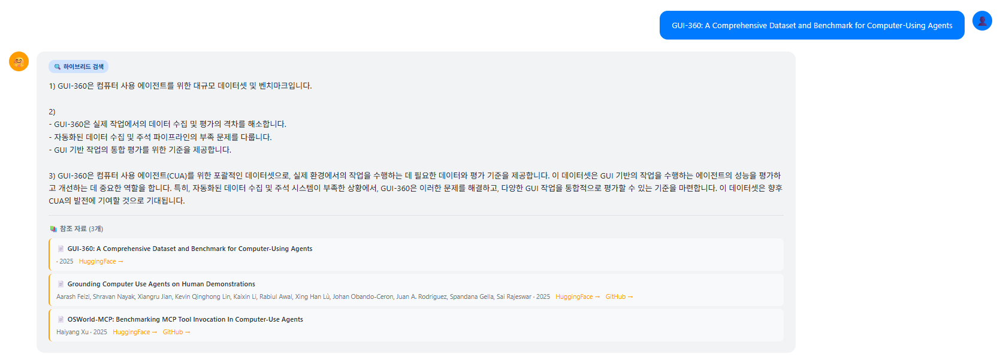
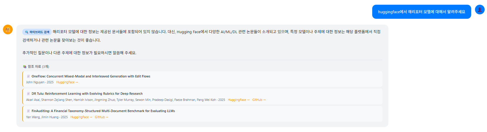
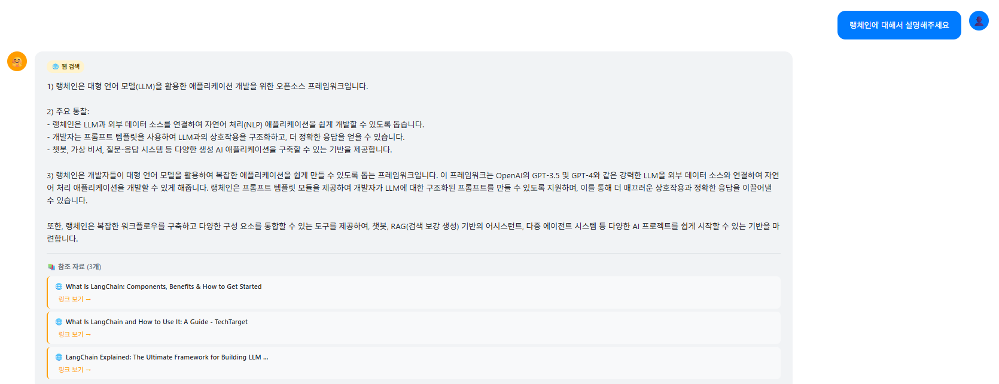
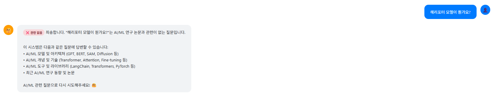

# 🤗 HuggingFace WeeklyPapers 기반 AI/ML/DL/LLM 스택 RAG 챗봇 

**팀명 : 안아조 검색해조 환각막아조 논문찾아조**

## 👥 팀원
|  <br> 김지은 |   <br> 박다정 |   <br> 오학성 |   <br> 정소영 |   <br> 황수현 |
|:------:|:------:|:------:|:------:|:------:|

## 1. 프로젝트 소개 및 목표

### 1.1 프로젝트 소개

이 프로젝트는 **HuggingFace Weekly Papers** 데이터를 자동으로 수집·분석하여,  
최신 **AI/ML/DL/LLM 논문 트렌드**를 질의응답 형태로 제공하는 **RAG 기반 논문 검색 챗봇**입니다.
  - **핵심 기능:**
  - HuggingFace Weekly Papers를 정기적으로 **크롤링**
  - 논문 Abstract를 **청킹 + 임베딩 + 벡터DB 저장**
  - **K-Means 클러스터링 + 클러스터 메타데이터**로 트렌드/토픽 구조화
  - **LangGraph** 기반 RAG 라우팅으로 검색 전략 자동 선택
  - **HTML/JS UI + FastAPI 백엔드**를 통한 웹 챗봇 제공
  - **클러스터 기반** 트렌드 키워드 추출 및 노출

### 1.2 목표

- RAG 파이프라인 전체(크롤링 → 전처리 → 벡터DB → RAG → UI)를 **직접 구현하고 이해하는 것**
- **클러스터링 + 하이브리드 검색(BM25 + Vector + RRF)** 으로 검색 품질 향상
- **LangGraph 기반 조건부 라우팅(Conditional Routing)** + 웹 검색 fallback 구조를 갖춘 AI 논문 검색 플랫폼을 구현

## 2. 프로젝트 디렉토리 구조
```bash
SKN20-3rd-2TEAM/
├── 01_data/                        # 데이터 및 벡터 저장소
│   ├── documents/                  # HuggingFace Weekly Papers 원본 JSON (연도/주차별)
│   │   ├── 2025/
│   │   │   └── W46/ doc251146001.json ...
│   ├── chunks/                     # 청킹된 문서 (.pkl)
│   ├── clusters/                   # 클러스터링 결과 (assignments, metadata)
│   └── vector_db/                  # Chroma VectorDB 파일
│
├── 02_src/                         # 모든 소스 코드
│   ├── 01_data_collection/         # 데이터 수집(크롤링) 단계
│   │   └── crawling.py             # HuggingFace WeeklyPapers 크롤러
│   │
│   ├── 02_utils/                   # 공통 유틸 및 전처리/인덱싱 도구
│   │   ├── chunking.py             # JSON → LangChain Document → 청킹 → .pkl 저장
│   │   ├── vectordb.py             # 청크 → 임베딩 → Chroma VectorDB 생성/로드
│   │   ├── clustering.py           # 문서 클러스터링 + 클러스터 메타데이터 생성
│   │   └── evaluate_embeddings.py  # 임베딩 모델별 성능/품질 비교 실험 스크립트
│   │
│   ├── 03_rag/                     # RAG 코어 로직
│   │   └── langgraph_hybrid.py      # LangGraph 기반 멀티 라우팅 RAG 시스템
│   │
│   ├── 04_ui/                      # 프론트엔드 / 서비스 레이어
│   │   ├── app.py            # FastAPI 메인 서버 (RAG + 통계/키워드 API)
│   │   └── chatbot.html          # HTML/JS 기반 Chat UI :contentReference[oaicite:1]{index=1}
│   │
│   └── 05_explain/                 # 실험/구현 설명 문서
│       ├── crawling.md             # 크롤링 설계, 파이프라인, 예외 처리 설명
│       ├── embedding_evaluation_report.md  # 임베딩 비교 실험 결과 및 분석
│       └── utils.md                # chunking/vectordb/clustering 등 유틸 모듈 설명 및 사용법
│
├── MDimages/                       # README 및 문서에 사용하는 이미지/다이어그램
│   # 예: 아키텍처 다이어그램, UI 스크린샷, 결과 그래프 등
│
├── .env                            # 환경 변수 설정 파일 (API 키, CHUNK_SIZE 등)
├── README.md                       # 프로젝트 설명 문서
└── requirements.txt                # Python 라이브러리 설치 목록
```

## 3. 시스템 아키텍처
 


## 📊 데이터 파이프라인

1. **크롤링** (`crawling.py`)
   - HuggingFace Weekly Papers에서 논문 메타데이터 수집
   - Abstract, Authors, Upvote, GitHub/HF URL 등을 JSON으로 저장

2. **청킹** (`chunking.py`)
   - 수집된 논문을 검색 최적화 크기로 분할
   - RecursiveCharacterTextSplitter 활용

3. **클러스터링 + 임베딩 + vectorDB** (`vectordb.py`)
   - K-Means 기반 논문 클러스터링 및 키워드 추출
   - 선택한 임베딩 모델(OpenAI / HuggingFace)로 벡터화
   - Chroma VectorDB 생성 및 저장

4. **RAG 시스템** (`langgraph_hybrid.py`)
   - LangGraph 기반 Multi-Agent RAG 구축
   - Hybrid Retrieval (Vector + BM25) 적용

5. **백엔드 + HTML UI** (`app.py` + `chatbot.html`)
   - FastAPI 백엔드로 RAG 시스템 서빙
   - HTML/JS 프론트엔드로 대화형 인터페이스 제공

## 4. 모듈별 상세 설명

### 📥 4.1 `crawling.py` — HuggingFace 논문 크롤링

**역할**  
- **Weekly Papers** 페이지에서 최신 논문 데이터 자동 수집  
- 논문 본문(`context`) + 메타데이터(`metadata`) 구조로 JSON 저장  
- TF-IDF / KeyBERT 기반 키워드 추가(옵션)  
- 이후 청킹·임베딩·클러스터링의 원본 데이터가 됨

**수집 JSON 구조**

| 필드 | 설명 | 예시 |
|------|------|------|
| **context** | 논문 Abstract + 커뮤니티 텍스트 | "SAM 3 introduces a novel concept..." |
| **metadata.title** | 논문 제목 | "SAM 3: Segment Anything with Concepts" |
| **metadata.authors** | 저자 목록 | ["Nicolas Carion", "Laura Gustafson", ...] |
| **metadata.publication_year** | 발행 연도 | 2025 |
| **metadata.github_url** | GitHub 링크 | "https://github.com/facebookresearch/sam3" |
| **metadata.huggingface_url** | HuggingFace 논문 링크 | "https://huggingface.co/papers/2511.16719" |
| **metadata.upvote** | 추천 수 | 108 |
---

### ✂️ 4.2 `chunking.py` — 텍스트 청킹

**역할**  
- `01_data/documents/` 아래 JSON 파일들을 읽어 `Document` 리스트로 변환 
- `.pkl` 파일로 저장하여 VectorDB 구축에 사용

**환경 변수 (.env)**

```env
CHUNK_SIZE=300
CHUNK_OVERLAP=45
```

| 파라미터 | 설명 | 기본값 |
|---------|------|--------|
| **CHUNK_SIZE** | 청크당 최대 문자 수 | 300 |
| **CHUNK_OVERLAP** | 청크 간 중복 문자 수 | 45 |
---

### 🧩 4.3 `clustering.py` — 자동 논문 클러스터링
**역할:** 논문(문서) 전체를 K-Means로 주제 그룹으로 묶고, 클러스터 메타데이터 생성

**주요 기능**
- 문서 임베딩 생성(OpenAI Embeddings + 캐시 관리)
- 최적 클러스터 수 자동 탐색(Elbow 기반)
- K-Means 클러스터링 수행
- 클러스터별 메타데이터 생성:
  - 대표 키워드 (TF-IDF + Lemmatization)
  - 클러스터 크기, 평균 upvote, 대표 논문 리스트 등
- 결과 저장  
  - `cluster_assignments.json` (doc_id → cluster_id)  
  - `cluster_metadata.json` (클러스터별 특징)

**특징**
- **vectordb.py에서 자동 호출되어 VectorDB 생성 과정에 포함됨**
---

### 🗄️ 4.4 `vectordb.py` — 임베딩 + VectorDB 생성/로드

**역할:** 청킹된 문서를 임베딩하고 Chroma VectorDB로 저장하거나 로드

**내부 흐름 (`vectordb_save`)**
1. 청크 로드 (`load_chunks_from_pkl`)
2. 클러스터링 수행 (`cluster_documents`)
3. 각 청크에 `cluster_id` 메타데이터 부착
4. 임베딩 모델 선택(OpenAI 또는 HuggingFace)
```env
MODEL_NAME=OpenAI
```
5. Chroma VectorDB 생성 및 디스크 저장


---

### 🤖 4.5 `langgraph_hybrid.py` — LangGraph 기반 RAG 검색 엔진
 
**역할:** LangGraph로 구성된 RAG 워크플로를 생성하고, 질문에 대한 최종 답변을 생성

**핵심 구성 요소**
- VectorDB + BM25 + RRF 하이브리드 검색
- 클러스터 기반 라우팅 (cluster_similarity_check_node)
- Tavily 기반 웹 검색 fallback
- 최종 답변 생성(한글 요약 구조화)

**주요 노드**
| 노드명 | 역할 |
|--------|------|
| **translate_node** | 한글 질문을 영어로 번역 (AI/ML 전문 용어 처리) |
| **topic_guard_node** | AI/ML/DL/LLM 관련 질문인지 사전 필터링 |
| **retrieve_node** | Vector Search + BM25 + RRF 하이브리드 검색 |
| **evaluate_document_relevance_node** | 문서 관련도 평가 (high/medium/low) |
| **cluster_similarity_check_node** | 동일 클러스터 내 추가 문서 검색 |
| **web_search_node** | Tavily API 웹 검색 (Fallback) |
| **generate_final_answer_node** | 최종 한글 답변 + 출처 생성 |
| **reject_node** | AI/ML 무관 질문 정중히 거절 |
---

### 💬 4.6 `app.py` & `chatbot.html` — 웹 서비스 UI/백엔드

**UI 파일:** `02_src/04_ui/chatbot.html`  
**API 서버:** `02_src/04_ui/app.py`

**백엔드 역할 (FastAPI)**
- 서버 실행 시 LangGraph RAG 시스템 초기화

#### API 엔드포인트

| 엔드포인트 | 메서드 | 설명 |
|-----------|--------|------|
| **/** | GET | HTML UI 제공 |
| **/api/health** | GET | 서버 상태 확인 |
| **/api/stats** | GET | 통계 정보 (논문 수, 청크 수, 클러스터 수, 데이터 기간) |
| **/api/trending-keywords** | GET | 상위 N개 트렌드 키워드 (기본값: 7개) |
| **/api/chat** | POST | 질문 → 답변 + 검색 타입 + 참조 문서 |

**프론트 역할 (HTML/JS)**
- Fetch API로 FastAPI와 통신
- Chat UI 렌더링(메시지 버블, 출처 카드, 검색 타입 뱃지 등)
- 트렌드 키워드 버튼 클릭 시 자동 질문 전송
- 반응형 다크/라이트 테마 포함


## 5. 응답 전략 및 환각 최소화 설계(Hallucination Reduction)
### **LangGraph 기반 흐름 제어(Conditional Routing)**  
#### 1) **Topic Guard 노드: 질문 자체의 타당성 검증**
- LLM이 답할 수 있는 주제인지 먼저 판별해 관련성 없는 질문은 즉시 거절  
- → 의미 없는 답변 생성(=환각)의 1차적 차단

#### 2) **Translate → Retrieve → Relevance Evaluation 노드 구성**
- 검색 전 질문을 영어로 번역하여 검색 성능 향상  
- Vector + BM25 + RRF 점수 기반으로 후보 문서 확보  
- 확보된 문서를 다시 **LLM으로 relevance 등급(high/medium/low)** 평가  
- → 검색 결과에 대한 LLM의 “자기 검증(self-check)” 수행

#### 3) **관련성이 낮을 경우 추가 경로 실행**
- medium → 동일 클러스터 내 재검색  
- low → 웹 검색(Tavily)로 fallback  
- → “내부 문서가 없을 때 억지로 답변하지 않도록” 설계

#### 4) **근거(소스)를 강제 반환**
- 최종 노드에서 반드시 근거 문서 목록을 함께 생성하도록 의무화  
- → 근거 없이 말만 길게 하는 환각형 답변 방지

---
### **강력한 시스템 프롬프트 규칙(System Prompt Policies) 통한 환각 억제**

#### 1) **RAG 컨텍스트 밖 내용을 임의로 생성하지 않는다.**  
   - 검색 결과에 포함된 정보만 사용  
   - 실존 여부가 불확실한 내용은 절대 추가하지 않음

#### 2) **근거 기반으로 설명**  
   - “왜 이 답변이 도출되었는지”를 설명하도록 유도  
   - bullet-point 형태로 핵심 인사이트를 구조화하여  
     LLM이 불필요한 상상적 서술을 하지 않도록 제한

#### 3) **웹 검색 fallback 시 출처 명시**  
   - RAG 컨텍스트 vs 웹 컨텍스트를 구분해서 표시  
   - 출처 정보(title, url)를 명시하도록 강제

#### 4) **한국어 최종 응답 규칙**  
   - 입력 언어와 관계없이 출력은 반드시 한국어  
   - 불필요한 번역 오류로 인한 환각 패턴 축소

#### 5) **관련성 부족 시 “답변 불가”를 정중히 반환**  
   - “근거가 없으므로 답변할 수 없음”이라는 전략적 선택 가능  
   - → 추측형 답변을 원천 차단하는 가장 중요한 룰
---
### 5.2 이 구조가 실제로 환각을 줄이는 이유

| 위험 요소 | 일반 RAG | 본 프로젝트의 LangGraph + Prompt |
|-----------|----------|------------------------------------|
| 문서 검색 실패 시 추측성 답변 | 발생 빈번 | **검색 실패 → cluster → web → reject** 단계적 대응 |
| 검색 결과는 있지만 관련성 낮음 | 억지 연결 | LLM이 직접 **관련성 평가(high/medium/low)** |
| 질문이 주제와 무관 | 억지로 답변 시도 | **Topic Guard**로 선제 차단 |
| 근거 표시 미흡 | 출처 불명 → 환각 증가 | **모든 답변에 sources 강제 포함** |
| LLM의 과잉 서술 | 불필요한 정보 덧붙임 | **프롬프트에서 구조적 제한 + 근거 기반 설명** |


### 5.3 📚 트렌드 논문 검색 결과 (by HuggingFace WeeklyPapers)

<br>하이브리드 검색👇<br>


<br>논문 제목 검색👇<br>
 
<br>거부 후 검색 방향 추천👇<br>

<br>웹 검색👇<br>

<br>응답 거부👇<br>



## 6. 향후 개발 계획 (TODO List)

### 📊 데이터 파이프라인 고도화
- 크롤링 주기 자동화 (cron / GitHub Actions)
- 실패한 크롤링/파싱 재시도 로직 구현
- 크롤링 로깅 시스템 강화

### 📈 트렌드 분석 확장
- 주차별/연도별 트렌드 키워드 변화 시각화
- 클러스터별 upvote 상위 논문 Top-N 제공
- 키워드 등장 빈도 추이 그래프

### 🔍 검색 고도화
- 쿼리 라우팅 임계값 자동 튜닝
- 사용자 피드백 기반 검색 결과 재랭킹
- A/B 테스트를 통한 검색 품질 개선

### 🎨 UI/UX 개선
- 대화 히스토리 저장 및 불러오기
- 답변 내 문장 클릭 → 관련 논문 하이라이트
- 북마크 기능 추가
- 반응형 모바일 UI 최적화

### 🛠️ 모델/인프라
- 대체 LLM 지원 (Anthropic Claude, Llama 등)
- Docker 기반 배포 스크립트
- 운영 환경 설정 자동화
- 모니터링 및 로깅 시스템 구축


## 🛠️ 기술 스택

### Backend

| 구분 | 기술 | 설명 |
|------|------|------|
| **언어** |  | 전체 파이프라인 구현 핵심 언어 |
| **웹 프레임워크** |  | 고성능 비동기 기반 API 서버 |
| **LLM 엔진** |  | 최종 답변 생성 모델 |
| **RAG Framework** |   | 하이브리드 검색 + 조건부 라우팅 RAG |
| **Vector DB** |  | 문서 임베딩 저장·검색 |
| **검색 엔진** |    | 점수 융합 기반 상위 문서 검색 |
| **임베딩 모델** |   | 범용·논문 특화·다국어 임베딩 |
| **클러스터링** |  | 논문 주제 클러스터링 |
| **전처리** |    | 불용어 제거, 표제화, 키워드 추출 |

### Frontend

| 구분 | 기술 | 설명 |
|------|------|------|
| **UI 구조** |   | 단일 페이지 챗봇 인터페이스 |
| **스타일링** |  | 다크/라이트 테마 & 반응형 디자인 |

### Data & Storage

| 구분 | 기술 | 핵심 개념 |
|------|------|-----------|
| **데이터 소스** |  | 매주 공개되는 최신 AI 논문 데이터를 수집하는 출처 |
| **원본 저장** |  | 크롤링한 논문의 제목, 초록, 메타데이터 등등 그대로 담아 기본 저장 |
| **청킹 결과** |  | 긴 텍스트를 검색하기 좋은 작은 조각들로 나눠 보관하는 중간 데이터 |
| **클러스터 정보** |  | 비슷한 내용의 논문들을 주제별로 묶고, 대표 키워드 등 특징을 정리한 정보 |
| **벡터 저장소** |  | 임베딩 벡터 기반 빠른 검색을 위한 저장소 |

## 💬 한 줄 회고

> #### 김지은
> 
---

> #### 박다정
> 전처리를 수정하면 프롬프트가 흔들리고, 프롬프트를 고치면 다시 전처리가 울고.... 웃고 있는건 openAI뿐.. 내 토큰 내놔.. 

---

> #### 오학성
> OpenAI는 어떻게 ChatGPT 없이 ChatGPT를 만들었는가

---

> #### 정소영
> 정소영: 프롬프트를 작성하면서 랭그래프 코드의 전반적인 흐름을 읽어볼 수 있었던 것이 가장 좋았던 것 같습니다. 또한 팀원들 전부 훌륭해서 즐겁게 팀프로젝트를 했습니다. 그런 의미에서 우리 OpenAI 많이 사랑해주시고 코딩은 클로드랑 같이 하세요. ^^ 감사합니다

---

> #### 황수현
> 

---
